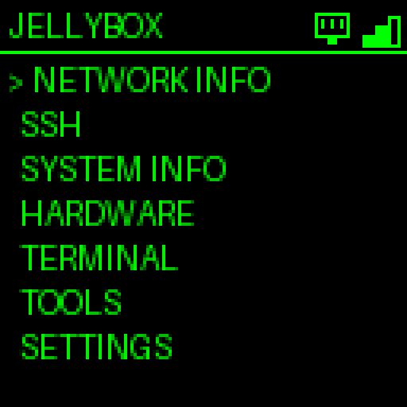
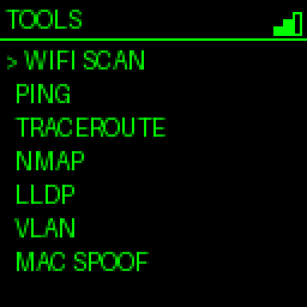
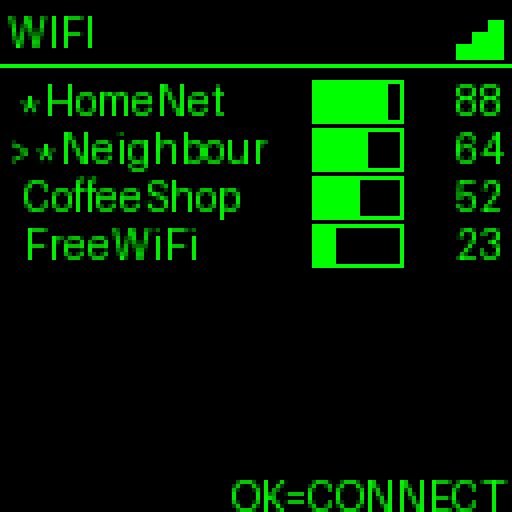
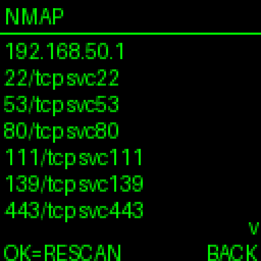
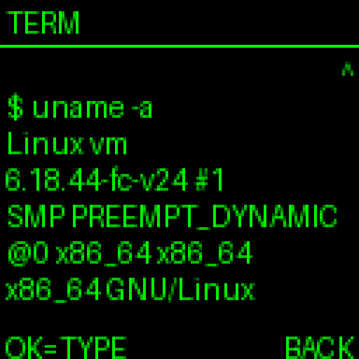
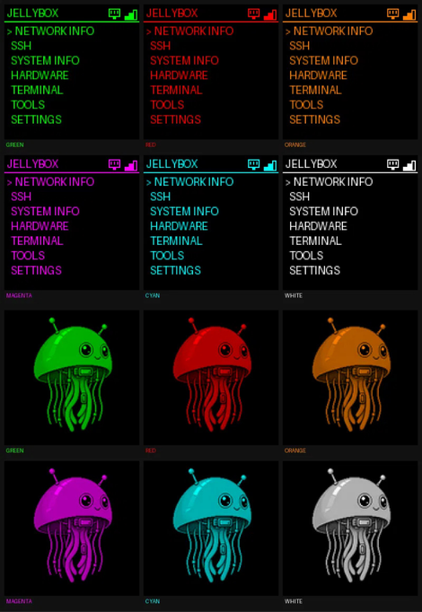

# JellyBox

JellyBox is a pocket-sized Raspberry Pi network diagnostics and authorized
security-testing toolbox with a 128×128 hardware interface. It runs on a
Raspberry Pi Zero 2 W with a Waveshare 1.44" LCD HAT and is driven entirely by
the HAT's joystick and buttons.

> JellyBox is for your own networks and authorized testing only. See
> [SECURITY.md](SECURITY.md).

<p align="center">
  
  
  
</p>
<p align="center">
  
  
  
</p>

## Overview

The application renders directly to the SPI display and reads the joystick and
keys over GPIO. Long-running work (scans, connects) runs on background workers
so the UI stays responsive, and the few actions that need root go through small,
argument-validated helper scripts rather than running the whole app as root.

## Features

- **Network Info** — active interface, IPv4, gateway, MAC, and current Wi-Fi
  SSID/signal where available.
- **Wi-Fi** — scan nearby networks and connect (with on-screen password entry).
  A supported external USB adapter can be selected as the working interface.
- **Ping** — editable target, live and cancelable.
- **Traceroute** — trace the path to a target and show hops on-device.
- **Nmap** — editable target and scan arguments; results can be saved.
- **LLDP Discovery** — show LLDP information advertised by neighboring network
  devices, including system name, port, VLAN, and management address where present.
- **VLAN Detection** — observe 802.1Q-tagged frames on an interface and report
  the VLAN IDs seen.
- **Hardware** — list network interfaces and USB devices; per-device actions,
  including toggling monitor mode on adapters that support it.
- **Terminal** — an on-device command console with scrollback and word-wrap.
- **MAC address tool** — set a random or custom MAC address, or restore the
  interface's permanent MAC.
- **WireGuard** — bring configured tunnels up/down and view status.
- **Results** — browse saved scan output.
- **Settings** — theme, brightness, and Wi-Fi/saved-network management.
- **System** — CPU, temperature, memory, disk, uptime, load; reboot.

Not all information is always available — LLDP requires neighbors that advertise
it, and VLAN detection requires tagged traffic to actually reach the selected
interface.

## Themes

JellyBox includes six interface themes that apply across the menu and boot
artwork:

- Green
- Red
- Orange
- Magenta
- Cyan
- White

<p align="center">

</p>

## Hardware

See [docs/HARDWARE.md](docs/HARDWARE.md) for the reference build and GPIO map. In
short: a Raspberry Pi Zero 2 W, a Waveshare 1.44" LCD HAT (ST7735S 128×128 SPI
display with a joystick and three keys), a battery/power board for portability,
and optionally a Waveshare Ethernet/USB hub HAT and a USB Wi-Fi adapter.

JellyBox does not read battery percentage or charging state; the power board
simply provides portable power.

## Controls

See [docs/CONTROLS.md](docs/CONTROLS.md). The joystick moves and selects, KEY1 is
Back, and KEY2/KEY3 act as Space/Delete while entering text.

## Installation

On a fresh Raspberry Pi OS install:

```bash
git clone https://github.com/Hacka-Gotchi/JellyBox.git jellybox
cd jellybox
sudo bash scripts/install-pi.sh
```

`install-pi.sh` installs the Linux tools JellyBox uses, the Python dependencies,
enables SPI, configures the privileged helpers, and installs the systemd
service. See [docs/INSTALL.md](docs/INSTALL.md) for a manual, step-by-step
alternative and troubleshooting.

## Running JellyBox

```bash
python3 main.py
# or, as the installed service:
sudo systemctl start jellybox
sudo journalctl -u jellybox -f
```

## Network Tools

Each tool, its Linux dependency, and its limitations are documented in
[docs/TOOLS.md](docs/TOOLS.md).

## Privileged Operations

JellyBox runs as an ordinary user. Monitor mode and MAC changes use the
`jellybox-iface` helper, VLAN capture uses `jellybox-sniff`, and WireGuard
control uses `jellybox-wg` — small root-owned scripts that validate their
arguments and are granted narrow passwordless `sudo`. Reboot is separately
whitelisted as the specific command `systemctl reboot`. Wi-Fi operations use a
polkit rule that grants the app user NetworkManager control. `setup-privileges.sh`
installs all of this. See [SECURITY.md](SECURITY.md).

## Project Structure

```
core/       app loop, settings, command runner, dependency detection
hardware/   display / buttons abstractions
  pi/       Raspberry Pi drivers (ST7735S display, GPIO buttons, pin map)
network/    network tool logic (ping, nmap, wifi, traceroute, lldp, vlan, ...)
system/     device, system-info, MAC, scan-store, and WireGuard helpers
ui/         pages/ (screens) and components/ (keyboard, menu, scroll view, ...)
scripts/    Pi install + privileged helpers
assets/     boot animation
docs/       hardware, controls, tools, and install documentation
tests/      unit tests, with fakes under tests/mocks
```

## Development

Most development and automated testing can be done without Raspberry Pi hardware.

```bash
python3 -m pip install -r requirements.txt
python3 -m unittest discover -s tests
```

Hardware is reached only through abstract interfaces, and the tests use fakes
under `tests/mocks`. See [CONTRIBUTING.md](CONTRIBUTING.md).

## Troubleshooting

- **Blank or shifted display** — confirm SPI is enabled and adjust
  `LCD_H_OFFSET` / `LCD_V_OFFSET` in `hardware/pi/pins.py` for your panel batch.
- **A tool reports "not found"** — install its Linux package (see
  [docs/TOOLS.md](docs/TOOLS.md)); `install-pi.sh` covers them all.
- **Wi-Fi connect / monitor mode / MAC change fails with a permission error** —
  run `sudo bash scripts/setup-privileges.sh`.

## Responsible Use

JellyBox is intended for network administration, diagnostics, authorized
security testing, red-team operations, and education. Use it only on systems
you own or are explicitly authorized to assess.

## License

[MIT](LICENSE).
