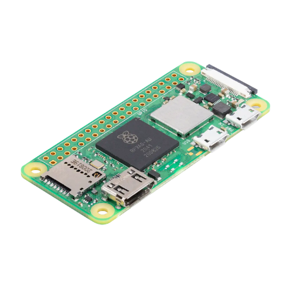
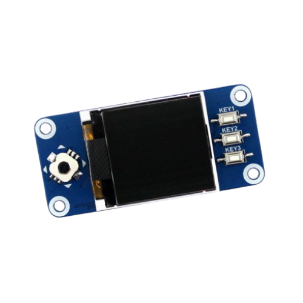
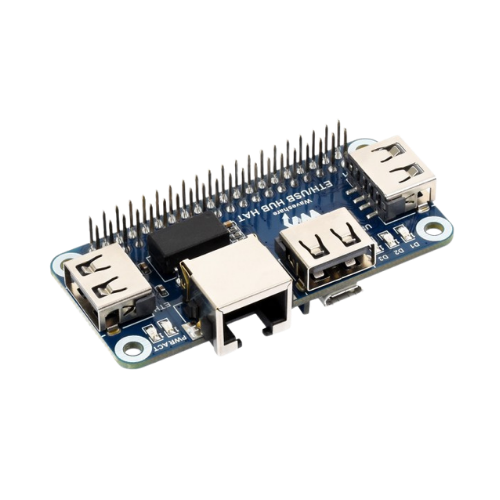

# JellyBox Hardware

The reference JellyBox build and GPIO map.

GPIO numbers use **BCM numbering** and are defined in
[`hardware/pi/pins.py`](../hardware/pi/pins.py), which is the source of truth
for the mappings documented below.

## Components

### Required

#### Raspberry Pi Zero 2 W

The main JellyBox computer. JellyBox is built around the Raspberry Pi Zero 2 W
form factor and GPIO layout.

#### Waveshare 1.44" LCD HAT

Provides the display and physical controls:

- ST7735S controller
- 128×128 SPI display
- 5-way joystick
- three hardware keys (KEY1–KEY3)
- GPIO-controlled backlight

The HAT connects through the Raspberry Pi 40-pin GPIO header.

#### PiSugar S 1200 mAh power board

Provides portable power to JellyBox.

JellyBox does **not** read battery percentage or charging telemetry. The power
board is used only as the device's portable power source.

### Recommended

#### Waveshare Ethernet / USB Hub HAT

Adds wired Ethernet and USB expansion. Wired connectivity is reflected in the
JellyBox interface, while the USB ports can be used with supported external
network adapters and other USB devices.

### Optional

#### USB Wi-Fi adapter

Adds an additional wireless interface.

Capabilities such as monitor mode depend on the adapter chipset, Linux driver,
and firmware support. JellyBox exposes monitor-mode controls for compatible
interfaces.

## Display

| Property | Value |
| --- | --- |
| Controller | ST7735S |
| Resolution | 128×128 |
| Bus | SPI0 |
| Chip select | CE0 |
| SPI clock | 16 MHz |

### Display GPIO (BCM)

| Signal | BCM GPIO |
| --- | ---: |
| SPI CE0 | 8 |
| DC | 25 |
| RESET | 27 |
| BACKLIGHT | 24 |

If the image is shifted or shows a coloured strip at an edge, adjust
`LCD_H_OFFSET` and `LCD_V_OFFSET` in
[`hardware/pi/pins.py`](../hardware/pi/pins.py).

Small offsets, usually around 1–3 pixels, may be required depending on the LCD
panel batch. If red and blue appear swapped, check the `LCD_BGR` setting.

## Controls GPIO (BCM)

| Physical control | JellyBox action | BCM GPIO |
| --- | --- | ---: |
| Joystick Up | Up | 6 |
| Joystick Down | Down | 19 |
| Joystick Left | Left / context dependent | 5 |
| Joystick Right | Right / context dependent | 26 |
| Joystick Press | Select / OK | 13 |
| KEY1 | Back | 21 |
| KEY2 | Space while entering text | 20 |
| KEY3 | Delete while entering text | 16 |

All controls are active-low with internal pull-ups.

See [CONTROLS.md](CONTROLS.md) for interaction details.
